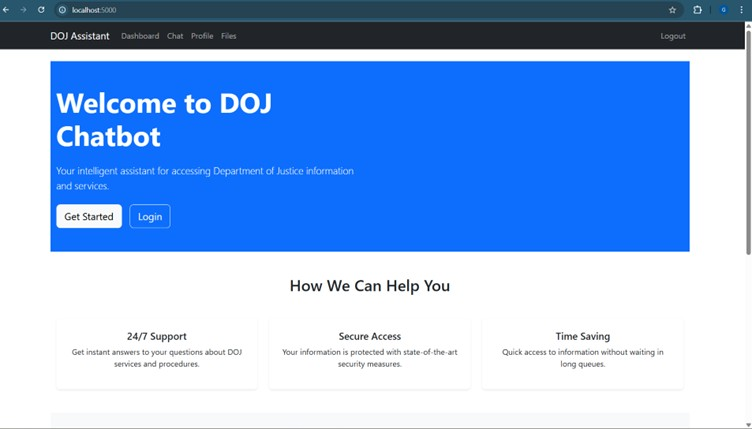
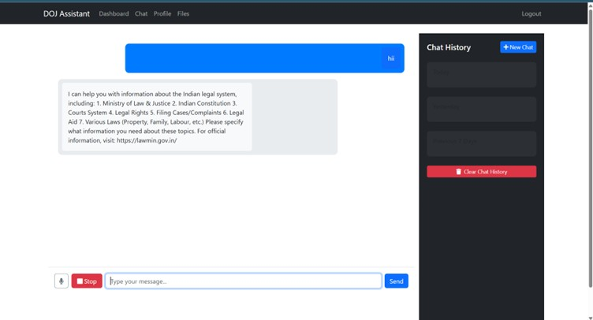

# AI-for-DOJ Website
# DoJ Website Chatbot
Developing an AI based interactive Chatbot or virtual assistant for the Department of Justice’s Website
## Project Overview
The DoJ Website Chatbot is an AI-based interactive virtual assistant designed to assist users with queries related to the Department of Justice (DoJ). The chatbot is capable of understanding natural language inputs, correcting spelling errors, and providing relevant information by searching through pre-loaded text data. This project aims to enhance the user experience on the Department of Justice's website by providing instant and accurate responses to common questions.

## Features
- **Natural Language Processing (NLP)**: Utilizes spaCy for sentence tokenization and lemmatization.
- **Spell Correction**: Integrated spell checker to correct user input for better query matching.
- **Fuzzy Matching**: Uses FuzzyWuzzy for partial string matching to find relevant information.
- **Voice Input**: Supports voice input recognition, allowing users to interact with the chatbot using spoken queries.
- **In-Memory Chat History**: Stores chat history in memory for the duration of the session.
- **Interactive User Interface**: A simple Flask-based web interface for users to interact with the chatbot.


## Project Structure
```
SGP_PROJECT-main/
│
├── app.py
├── chat_history.json
├── Jenkinsfile
├── README.md
├── .gitignore
├── .env
│
├── static/
    ├──style.css
├── templates/
│   ├── backup_manager.html
│   ├── base.html
│   ├── chat.html
│   ├── chatbot.html
│   ├── dashboard.html
│   ├── files.html
│   ├── index.html
│   ├── login.html
│   ├── profile.html
│   ├── register.html
│
└── utils/
```

## Installation

### Prerequisites
Ensure that you have Python 3.7 or higher installed on your system.

### Clone the Repository
```bash
git clone https://github.com/yourusername/DoJ_Website_Chatbot.git
cd DoJ_Website_Chatbot
```

### Create a Virtual Environment
It's recommended to use a virtual environment to manage your project dependencies:
```bash
python3 -m venv venv
source venv/bin/activate  # On Windows, use `venv\Scripts\activate`
```

### Install Dependencies
Install the required Python packages:
```bash
pip install -r requirements.txt
```

### Download spaCy Language Model
Download the necessary spaCy English model:
```bash
python -m spacy download en_core_web_sm
```

## Running the Application
To run the Flask application locally, execute the following command:
```bash
python app.py
```

Open your web browser and go to `localhost:5000` to interact with the chatbot.

## This is the Chatbot interface you will see



## Usage
1. Enter your query in the chat box.
2. The chatbot will process your query, correct any spelling errors, and search for the most relevant information from the provided text data.
3. The response will be displayed in the chat interface.
